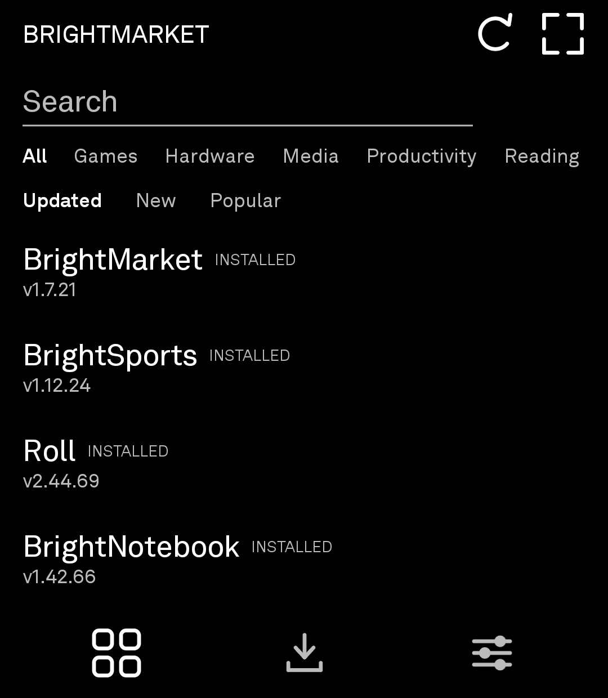
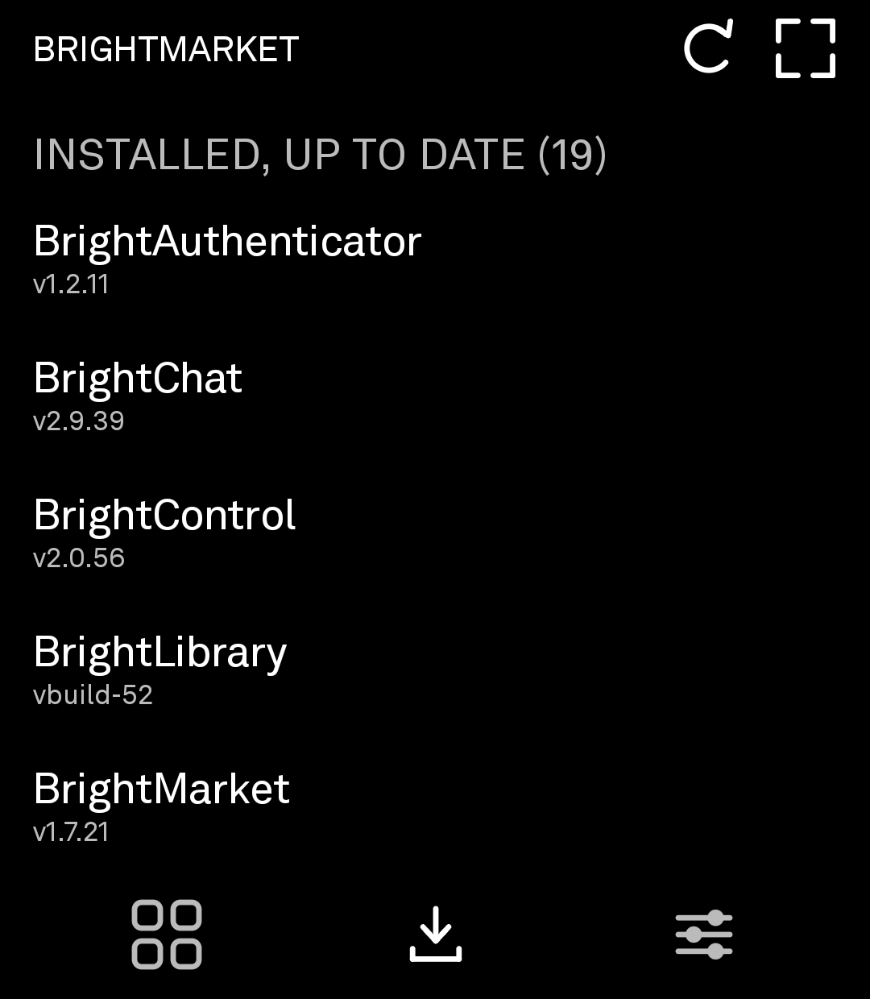
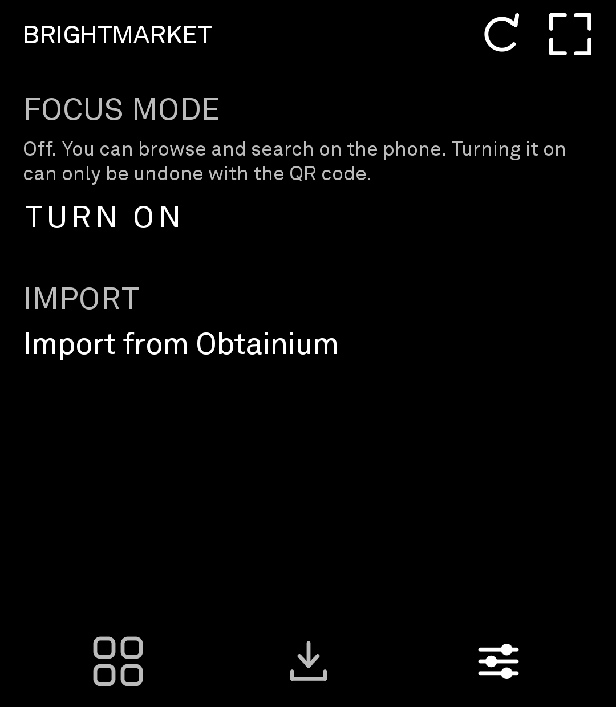

# BrightMarket

An app store for the Light Phone III. It finds sideloaded apps, installs them, and
tells you when they have updates. Everything in it is free and open source, and
every download comes from a GitHub release.

<p align="center">
  
</p>

Scan that with the phone, or open **[brightmarket.gzl.dev/apk](https://brightmarket.gzl.dev/apk)**,
which always redirects to the current signed release. Every other app installs from
inside BrightMarket once it's on the phone — this is the only one that has to come
from the web, for the obvious reason.

Browse the catalogue at **[brightmarket.gzl.dev](https://brightmarket.gzl.dev)**.

<p align="center">
  
  
  
</p>

`com.gios.brightmarket`, minSdk 30. The rest of the portfolio targets 29; wireless
debugging, which the planned silent-install path needs, is Android 11 and up.

## What it's for

Sideloading on the Light Phone works, but keeping fifteen sideloaded apps current
means checking fifteen release pages. Obtainium solves that and solves it well — it
is just built for a normal Android. The wheel does nothing in it, and it has no idea
which of your APKs is a Light Phone app, because it only knows the GitHub links you
pasted into it yourself.

BrightMarket does the same update tracking, fits this phone, and adds a catalogue on
top so there is somewhere to find apps in the first place.

## Coming from Obtainium

**Import from Obtainium**, in Settings, takes an Obtainium export file and picks up
everything in it — including apps that aren't in the catalogue, which are kept and
marked `UNLISTED` rather than dropped.

It reads both the current `{"apps":[{"app":{…}}]}` shape and the older bare-array
exports. Matching is on **applicationId first**, falling back to the repo URL, so an
export made before the Light→Bright rename still resolves: the repositories were
renamed but the applicationIds never were. Anything it genuinely can't place is
reported as a count, not silently discarded.

You don't have to choose. Both can track the same repos.

## Focus mode

An app store on a Light Phone is still an infinite scrolling feed, which is a little
self-defeating. So browsing is optional, and the app asks on first launch.

With Focus mode on, the phone shows what you have installed and what needs updating,
and nothing else. New apps come from scanning a QR code off the desktop site. You can
still update everything without a laptop; you just can't browse.

Turning it back on means scanning a code at
[brightmarket.gzl.dev](https://brightmarket.gzl.dev). That is not real security — it
is a link, and you could type it — but it does mean the thing you'd have to go and
find is on a different screen in a different room.

## Adding your app

Use the [submission portal](https://brightmarket.gzl.dev/submit.html): sign in with
GitHub, pick a repo that publishes APK releases. The OAuth scope is `read:user`, it
reads only your public repositories, and it cannot write anything anywhere. Opening
an issue works too.

Submission checks are structural — that the release exists, has one APK asset, and
declares a versionCode that moves forwards. Nobody reads your code. Being listed
means the release is put together properly and nothing more, and the site says so.

## How it works

There is no server and no database.
[`gi-os/brightmarket-index`](https://github.com/gi-os/brightmarket-index) holds a
curated `apps.yml`; a GitHub Action turns it into a single `index-v1.json` served
from GitHub Pages. The app fetches that one file.

The builder downloads each APK and reads the real `versionCode` and `applicationId`
out of it rather than trusting the tag. That matters more than it sounds: for plain
semver the trailing number goes *backwards* on a minor bump — 1.2.2 to 1.3.0 — which
would tell every user they were permanently up to date.

Sorting needs no analytics. **Popular** sums GitHub's own `download_count`,
**Updated** uses the release timestamp, **New** uses the date the index first saw the
app. BrightMarket has no backend to report to and never sees a user.

## Installing apps, and what is actually checked

Installs go through `PackageInstaller` with the system's own confirmation dialog, so
it works on any device with no setup.

Every download is checked against the `sha256` in the index before it reaches the
installer. That hash is generated by the index builder from the actual release asset,
and it is the thing that makes a download trustworthy — not the source it came from.
Repos you add yourself by QR have no hash, because nothing generated one, and they
are marked `UNLISTED` so the difference is visible rather than assumed.

The signing certificate of every listed app is pinned the first time it is indexed,
and the build fails if it changes, so an app cannot quietly change hands. None of
this is a code review.

A silent install path is planned — an embedded ADB client pairing the phone to its
own `adbd` over loopback, which gets shell uid and therefore `INSTALL_PACKAGES`. The
dialog stays regardless: an ADB maintainer has proposed binding `adbd` to `wlan0`
only, which would end that technique outright.

## Building

```
./gradlew :app:assembleRelease
```

A local build produces an installable APK signed with your debug key. It will not
install over a release build, and that is deliberate — a build that isn't the real
thing should say so at install time rather than pretend.

The release key lives only in CI, as the `KEYSTORE_B64` and `KEYSTORE_PASSWORD`
secrets. Its certificate SHA-256 is pinned in `signing-fingerprint.txt` and CI fails
if the built APK doesn't match, because a changed certificate reaches users as an
opaque `Failure: Invalid` and nothing else. Exactly one APK is attached per release.

> **If you installed BrightMarket before v1.10:** that build was signed with a key
> committed to this repository, password and all, which meant anyone could produce an
> APK that Android would accept as an update to it. The key is now a CI secret and
> the new one has never been in the tree. Android won't install across a certificate
> change, so this once you have to uninstall and reinstall. Nothing is lost except
> BrightMarket's own settings — the apps you installed with it are untouched.

## Nightly builds

A push to this repo publishes a **nightly**, marked as a prerelease. The
catalogue skips prereleases, so a nightly is only ever offered to someone who
has asked for one in Settings → Updates. Official releases are cut deliberately
— `[release]` in the commit's **subject line**, or running the workflow by hand.

A nightly is verified exactly as hard as a release: the index downloads it,
hashes it, and reads its versionCode out of the APK. It's only offered when it's
actually ahead of stable, so an official release cut after the last nightly
moves everyone forward rather than stranding the people who opted in.

## Reporting a bug

Shake the phone. It files an issue with a screenshot and the recent log, so you don't
have to describe what you saw.

## Licence

MIT. See [LICENSE](LICENSE).
